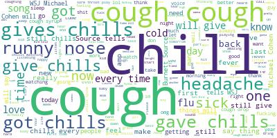
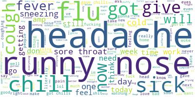

# TwitterFlu
## Separating Semantic Meaning in Health-Related Tweets

**Note: Work still in progress**

## Motivation:
The CDC estimates that there have been 16,400-26,700 deaths caused by influenza in the United States in the past 5 months alone (ref). Accurately predicting when and where influenza is likely to peak can help hospitals stock up on vaccines ahead of flu season as well as prepare for the influx of patients they may receive. Flu prediction services are also of interest to the general public, city officials, epidemiologists, and pharmaceutical companies. One of the first attempts to use machine learning to predict the flu was by Google in 2009. While this project was generally considered a failure (ref), flu prediction is still being actively pursued. Notably, in 2013, the CDC sponsored a flu prediction challenge encouraging more people to work on solving this problem (ref). The following is a listing of flu prediction services/algorithms that have been developed over the years:

* 2009	Google Flu Tracker 
* 2011	SickWeather
* 2013	CDC Challenge 
* 2013	University of Colorado paper 
*	2014	Columbia University paper 
*	2015	FluNearYou
*	2016	Theraflu Cold & Flu Tracker
*	2017	Flumoji
*	2017	University of Chicago paper

Interestingly, the pharmaceutical company, GSK, is involved in two flu prediction apps: Theraflu Cold and Flu Tracker and Flumoji. It is also worth pointing out that several of these services are using Twitter data as a feature in their models (SickWeather, University of Colorado, and Theraflu Cold and Flu Tracker by proxy of Sickweather). 

Working with Twitter data presents another challenge in that it can be difficult to sort out messages related to being sick from the noise. For example, the word “sick” can be used to mean ill, tired of, or cool. Related words such as cough, chills, and sneeze also have multiple meanings (ex. cough cough, gives me chills, nothing to sneeze at). To get around this problem, researchers at the University of Colorado used Amazon Mechanical Turk to manually label tweets as about being sick or not. The goal of my project is to focus on this bottleneck and see if I could use natural language processing and unsupervised learning techniques to cluster tweets based on their contents into categories of sick or not sick. These labels could then be applied to classification algorithms which would feed into prediction algorithms in order to forecast peaks of flu incidents. 

## Design: 
I collected tweets containing health-related search words and applied stemming on these to break the words down into their root forms. I then applied word vectorizer with bi-grams to generate counts of all the words and bi-grams used in my corpus of tweets. To reduce my features, I applied LDA, LSA, and NMF. As NMF gave me the most interpretable components, I chose these features and fed these into my clustering model (K means clustering).  

## Data:
17,880 tweets collected using the following search terms: Sick, Fever, Flu, Headache, Cough, Chills, Sore throat, Runny nose, Sneezing. 

## Cleaning and Feature Engineering: 
*	Filtered out retweets, dropped duplicates
*	Removed hyperlinks and mentions, separated hashtags into their own column
*	Merged 9 DataFrames into one to use for EDA, topic modeling, and clustering.
*	Compared results from PorterStemmer and SnowballStemmer – Chose SnowballStemmer
*	Ran CountVectorizer on words using English stopwords, (1,2) n-grams, and a minimum document frequency of 2. 

## Algorithms:
#### Topic Modeling: 
Performed NMF, LSA, and LDA. Compared topics across models and chose NMF as it gave the most interpretable topics. I chose 25 topics since it is large enough that there are more topics than search terms so I will not simply re-identify the search terms I used to get the tweets. Furthermore, the slope of the reconstruction error curve starts to get less steep at this point (although there is not a clear elbow point). 

#### Clustering: 
Compared k=2 and k=8. I chose k=2 to see if it could magically separate out sick/not sick posts, it did not. I then chose k=8 based on the elbow plot (using silhouette scores). Looking at word clouds (for quick visualization) it looks like 1 out of 8 clusters is likely to contain tweets that are not about being ill (see below) while the others are likely to contain tweets about being ill (representative word cloud below).

word cloud from the cluster likely to contain tweets not about being ill:

Word cloud from another representative cluster likely to contain tweets about being ill: 

## Conclusions & Future Directions:
Word and bi-gram counts alone can pick out some differences between the context of words within tweets. However, it appears that these methods are not enough to pick out the semantic meaning of single words. There are other tools, such as BERT (ref) which are suited to this task that I would love to learn to use and apply to this data. Also, the annotated tweets used by the researchers at the University of Colorado are publicly available and I plan to use these to validate my future work. Once I am able to generate accurate labels, I plan to plot these tweets on a map in order to visualize hotspots of illness. It will be interesting work with streaming data and to see how the map changes over time. 

## Tools: 
*	Jupyter Notebooks
*	Spyder IDE
*	Pandas, Pickles, Seaborn
*	Scikit learn 
*	TwitterSearch
*	Gensim
*	NLTK
*	Wordcloud 
*	AWS
*	WinSCP and Putty
